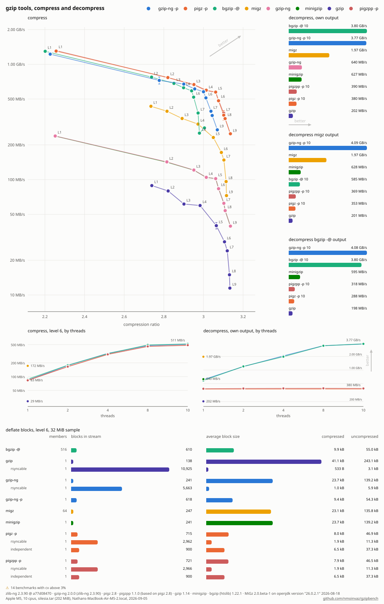

# gzipbench

Whole-process gzip command line benchmarks across implementations.

`bench.py` times each tool compressing and decompressing one input stream,
stdin to stdout, the way the tools sit in pipelines, so startup, threading,
and IO all count. Every decoder's warmup output is verified against the
input's size and crc. In-process buffer codec benchmarks are
[codecbench]'s job instead.

The variant matrix follows the [gzip-ng] README benchmarks. Each tool runs
the compression level ladder, levels 1 through 9, serial and parallel
variants separately, parallel tools sweep thread counts at level 6, and
the decompression grid crosses decoders with producers, gzip-ng decoding
bgzip and MiGz output as well as its own. A deflate block census then
compresses a capped sample in each mode a tool supports, normal,
`--rsyncable`, and independent, and counts the blocks and members in every
stream by parsing the deflate bitstream itself
(`scripts/deflate_blocks.py`).

## Tools

| Variant      | Tool                     | Parallel flag | Requires        |
| ------------ | ------------------------ | ------------- | --------------- |
| `gzip-ng -p` | [gzip-ng]                | `-p`          |                 |
| `pigz -p`    | [pigz]                   | `-p`          |                 |
| `pigzpp -p`  | [pigzpp] (`-E zlib`)     | `-p`          |                 |
| `bgzip -@`   | [bgzip] (htslib)         | `-@`          |                 |
| `migz`       | [MiGz] (pool of cpus)    | always        | a JDK           |
| `gzip-ng`    | [gzip-ng] serial         |               |                 |
| `minigzip`   | [zlib-ng]'s minigzip     |               |                 |
| `gzip`       | [gzip]                   |               |                 |

[gzip-ng]: https://github.com/nmoinvaz/gzip-ng
[pigz]: https://zlib.net/pigz/
[pigzpp]: https://github.com/thammegowda/pigzpp
[bgzip]: https://github.com/samtools/htslib
[MiGz]: https://github.com/linkedin/migz
[zlib-ng]: https://github.com/zlib-ng/zlib-ng
[gzip]: https://www.gnu.org/software/gzip/
[codecbench]: https://github.com/nmoinvaz/codecbench

Tools in `tools/bin` are preferred, then PATH, missing ones are skipped
and noted. `GZIPNG`, `PIGZ`, `PIGZPP`, `GZIP`, `MINIGZIP`, `BGZIP`, and
`JAVA` override the lookup. MiGz has no standalone binary, `tools/fetch_migz.py`
pulls the pinned jars from Maven Central once and compiles a small pipe
CLI, JVM start stays part of its measurements.

`tools/build_tools.py` builds gzip-ng, minigzip, pigz, pigzpp, and bgzip
against zlib-ng develop into `tools/bin`, so every zlib-linked tool
measures the same library. It writes `tools/zlibng.json`, and the graphs put that
zlib-ng version and commit in their footer. GNU gzip carries its own
deflate and MiGz uses the JVM's zlib, so those two stay system provided.

## Running

```sh
python3 tools/fetch_migz.py
python3 tools/build_tools.py
curl -LO https://mirror.circlestorm.org/silesia.tar
./bench.py silesia.tar -o results/all-tools.json
python3 scripts/graph_runs.py results/all-tools.json
```

The showcased run measures the [Silesia corpus], the common ground of
compression benchmarks. With no input files the benchmark instead
generates a deterministic synthetic mix of source-like text, build-log
lines, and random blocks, weighted to land near the 4.8 to 1 of the
gzip-ng README corpus under `gzip -6`. Any files passed are concatenated
into one stream.

[Silesia corpus]: http://sun.aei.polsl.pl/~sdeor/index.php?page=silesia

`--levels`, `--threads`, `--runs`, `--size-mb`, and `--blocks-mb` trim or
grow the matrix, `./bench.py --help` lists the defaults. Everything needs
only the Python standard library.

## Comparing

```sh
python3 scripts/compare_runs.py before.json after.json
```

Rows match by benchmark name, so two runs of the same matrix, two machines,
or two gzip-ng builds, compare directly with time and ratio deltas.

## Graphing

`scripts/graph_runs.py` turns a run into a speed versus ratio SVG, the
level ladders connected in order, a decompression throughput panel
including the cross-decode pairs, thread scaling line panels, deflate
block census panels, block counts and average block sizes across the
normal, rsyncable, and independent modes, repetition error bars, and
machine specs. An aggregate table prints to stdout.

All tools on the [Silesia corpus](https://mirror.circlestorm.org/silesia.tar)
(`silesia.tar`, 202 MiB), the common ground of compression benchmarks:


